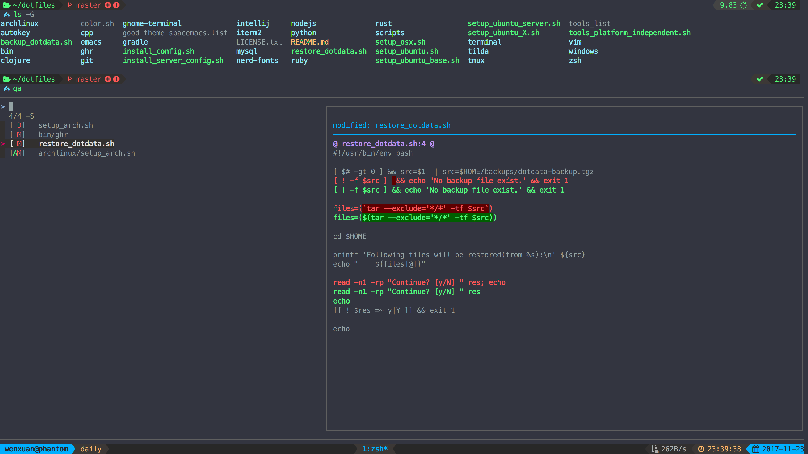
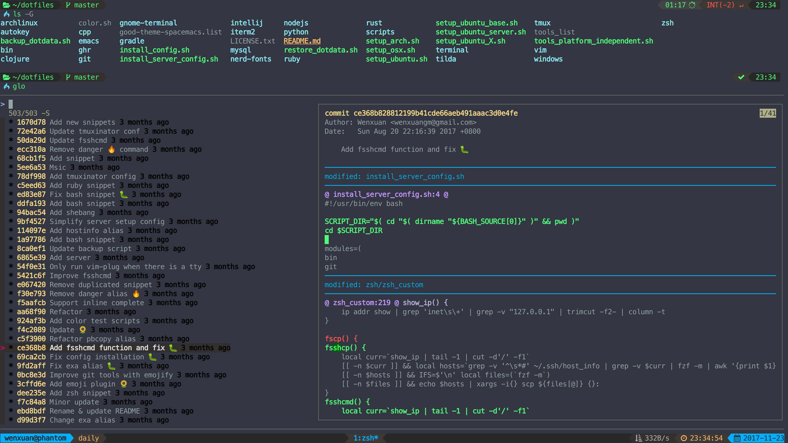
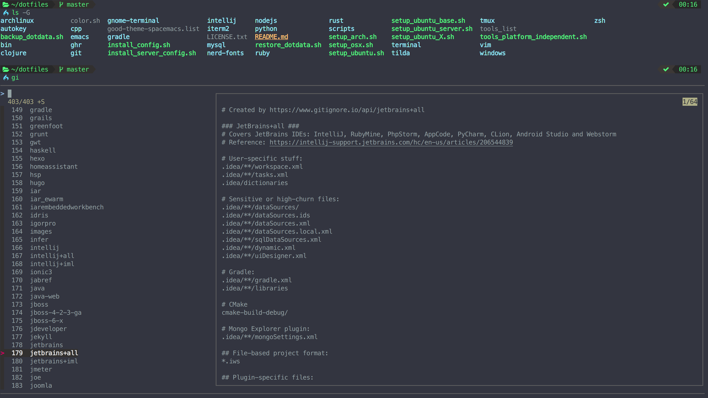

# forgit

`forgit` is a utility tool for git taking advantage of fuzzy finder fzf.

## Installation

Make sure you have [`fzf`](https://github.com/junegunn/fzf) installed.

### for [zplug](https://github.com/zplug/zplug) (Recommend)

``` zsh
zplug 'wfxr/forgit', defer:1
```

### for [zgen](https://github.com/tarjoilija/zgen)
```
zgen load wfxr/forgit
```

### for [antigen](https//github.com/zsh-users/antigen)

```
antigen bundle wfxr/forgit
```

### Manually

Clone this repo somewhere and source the `forgit.plugin.zsh` at ~/.zshrc.

## Commands

### ga

Interactive `git add` selector



| Keybind          | Action                     |
| ---------------- | -------------------------- |
| `<Tab>`          | Mark/Unmark(and move down) |
| `<C-r>`          | Reverse selection          |
| `<Enter>`        | Confirm and quit           |
| `<C-j/n><C-k/p>` | Selection down/up          |
| `<?>`            | Toggle preview window      |
| `<A-w>`          | Toggle preview wrap        |
| `<A-j><A-k>`     | Preview down/up            |

### glo

Interactive `git log` browser



| Keybind          | Action                |
| ---------------- | --------------------- |
| `<Enter>`        | Fullscreen preview    |
| `<C-j/n><C-k/p>` | Selection down/up     |
| `<?>`            | Toggle preview window |
| `<A-w>`          | Toggle preview wrap   |
| `<A-j><A-k>`     | Preview down/up       |

### gd

Interactive `git diff` browser

| Keybind          | Action                |
| ---------------- | --------------------- |
| `<Enter>`        | Fullscreen preview    |
| `<C-j/n><C-k/p>` | Selection down/up     |
| `<?>`            | Toggle preview window |
| `<A-w>`          | Toggle preview wrap   |
| `<A-j><A-k>`     | Preview down/up       |

### gi

Interactive `.gitignore` generator



## Custom options

You can change the default aliases by defining these variables below.

``` bash
# Define them before sourcing the plugin if you don't use any plugin manager.
forgit_log=glo
forgit_diff=gd
forgit_add=ga
forgit_ignore=gi
```

You can add custom fzf options for `forgit`, including keybinds, layout, etc.
(No need to repeat the options already defined in `FZF_DEFAULT_OPTS`)

``` bash
FORGIT_FZF_DEFAULT_OPTS="
--exact
--border
--cycle
--reverse
--height '80%'
"
```

### Tips

- Hit `q` to Quit from full screen preview any time.
- Install [`diff-so-fancy`](https://github.com/so-fancy/diff-so-fancy) to have better `diff` output.
- Call `glo` with arguments to get logs only related to these files or directories(eg, `glo main.go test.go`).
- Call `gi` with arguments to get wanted `.gitignore` contents directly(eg, `gi c++`).

## [License](LICENSE.txt)

The MIT License (MIT)

Copyright (c) 2018 Wenxuan Zhang
