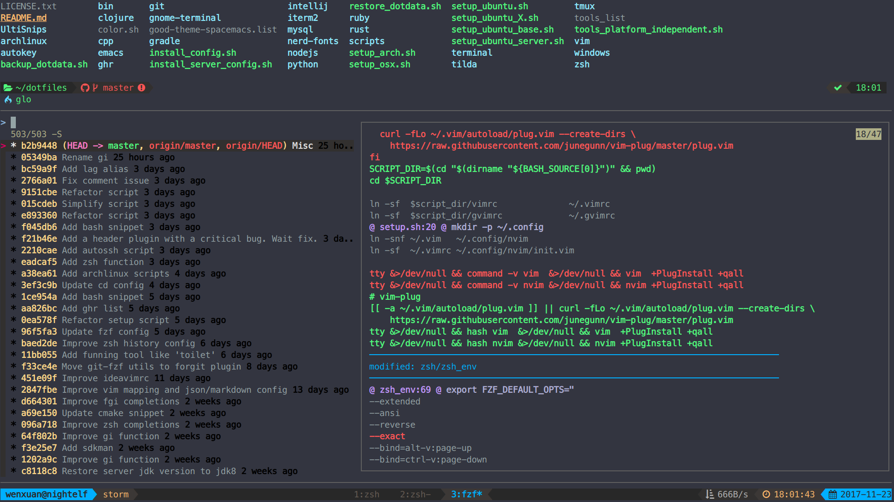

# forgit

`forgit` is a utility tool for git taking advantage of fuzzy finder [`fzf`](https://github.com/junegunn/fzf).

## Demo

## Install

### zplug([Recommand](https://github.com/zplug/zplug))

Just add this line to your zshrc:

    `zplug 'wfxr/forgit', defer:1`

### Manually

Clone this repo somewhere and source the `forgit.plugin.zsh` at ~/.zshrc.

## Commands

### ga

Interactive `git add`

    <Ctrl + N/P> Selection down/up
    <Alt + N/P>  Preview down/up
    <Tab>        Mark/Unmark and move down
    <Enter>      Confirml and quit

### glo

Interactive `git log`

    <Ctrl + N/P> Selection down/up
    <Alt + N/P>  Preview down/up
    <Enter>      Fullscreen preview

### gd

Interactive `git diff`

    <Ctrl + N/P> Selection down/up
    <Alt + N/P>  Preview down/up
    <Enter>      Fullscreen preview

### gi

Interactive `.gitignore` generator

### Tips

Install [`diff-so-fancy`](https://github.com/so-fancy/diff-so-fancy) for better quality of diff result.

## License

[MIT](LICENSE.txt)
